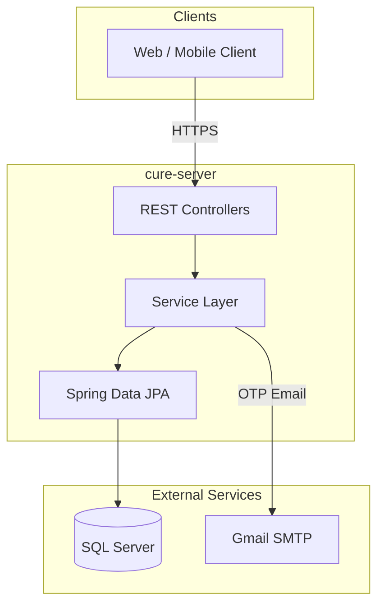
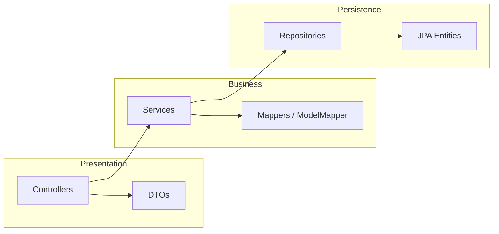
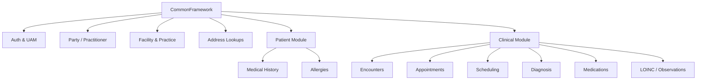
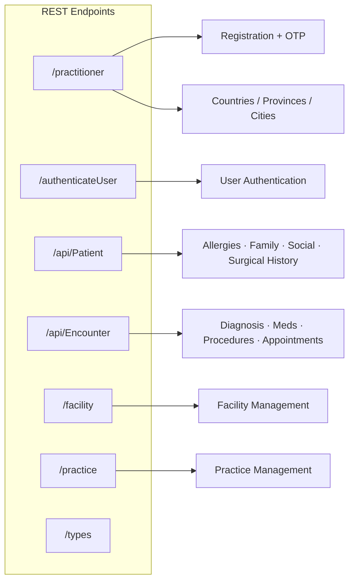
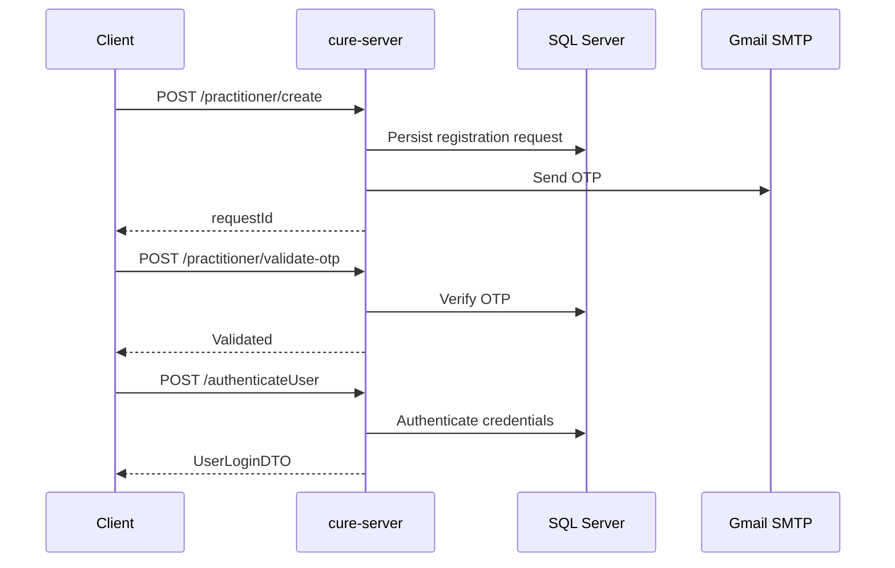
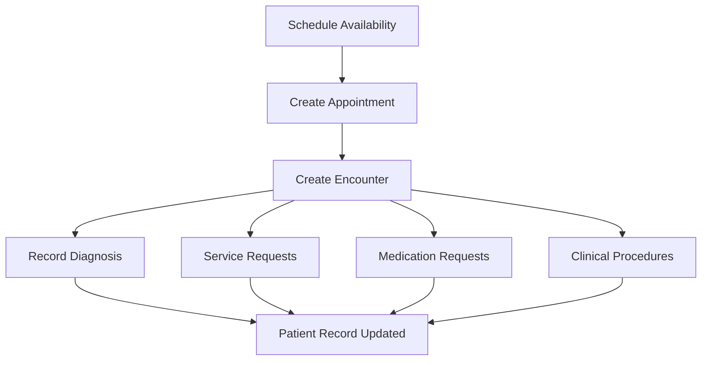
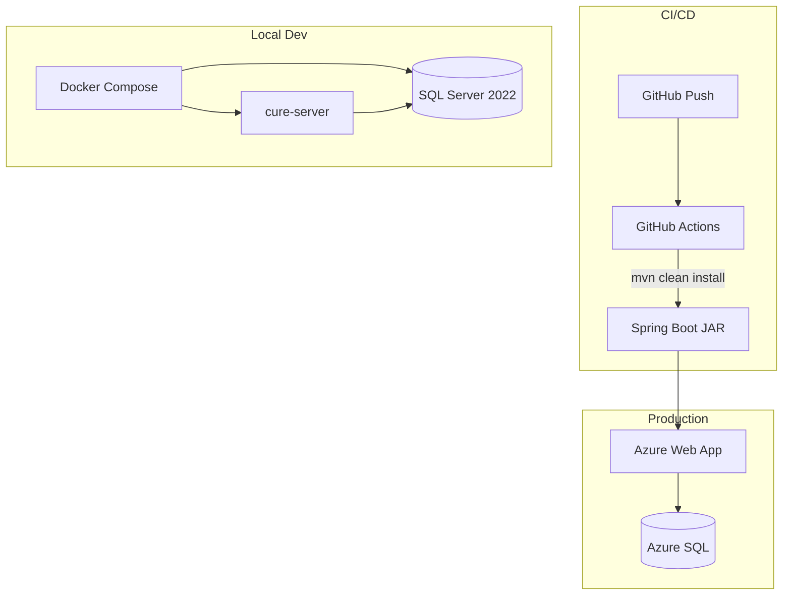

# cure-server

Healthcare REST API — Spring Boot · Java 17 · SQL Server

---

## System overview

---

## Layered architecture

---

## Domain modules

---

## API surface

---

## Practitioner onboarding

---

## Clinical encounter flow

---

## Deployment

---

## Tech stack

| | |
|---|---|
| **Runtime** | Java 17 · Spring Boot 3.1 |
| **Data** | Spring Data JPA · Microsoft SQL Server |
| **Mapping** | ModelMapper · custom DTO mappers |
| **Deploy** | Azure Web App · Docker Compose |
